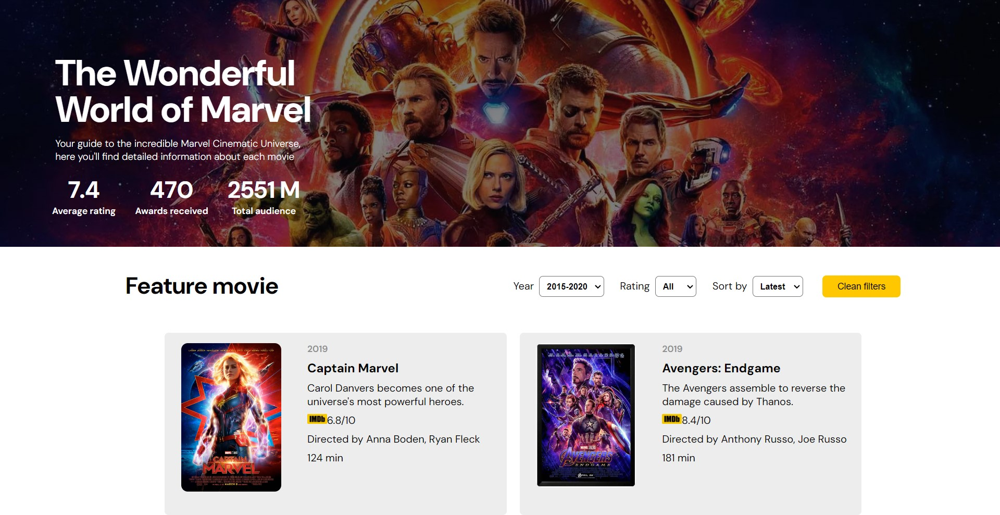
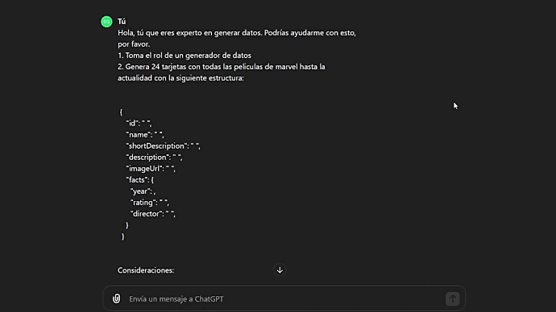

# The Wonderful World of Marvel

## Descripción

"The Wonderful World of Marvel" es una web interactiva que permite a los usuarios explorar el universo cinematográfico de Marvel. Proporciona detalles sobre cada película, como el año de lanzamiento, calificación, director y duración. La web también permite a los usuarios filtrar y ordenar las películas según diferentes criterios.

## Características

- **Visualización de películas**: Muestra tarjetas de películas con detalles como título, imagen, año, calificación, director y duración.
- **Filtros**: Permite filtrar las películas por año, calificación y otros criterios.
- **Ordenamiento**: Los usuarios pueden ordenar las películas por diferentes atributos como el más reciente o el más antiguo.
- **Estadísticas**: Muestra estadísticas generales sobre las películas, como la calificación promedio, los premios recibidos y el total de audiencia.
- **Responsive**: La web está diseñada para ser responsiva y se adapta a diferentes tamaños de pantalla.
- **Interactividad**: Los usuarios pueden limpiar los filtros aplicados con un botón específico.

## Proceso de Desarrollo

### Sprint 1
- **Leer el README**: Entender el propósito del proyecto y los requisitos iniciales.
- **Historias de Usuario**: Definir las necesidades y expectativas de los usuarios.
- **Prototipo**: Crear un prototipo inicial de la web.
- **Generar Datos con IA**: Crear un dataset de películas utilizando herramientas de inteligencia artificial.
- **Git y GitHub**: Aprender a usar Git y GitHub para la colaboración en el proyecto.
- **Dataset.js**: Implementar el archivo de datos `dataset.js`.

### Sprint 2
- **HTML**: Estructurar la página web usando HTML.
- **Test de Prompting**: Probar los datos generados en `dataset.js`.
- **View.js**: Desarrollar la lógica para renderizar las tarjetas de películas en HTML.
- **Pull Request**: Realizar una pull request para revisar y fusionar cambios.
- **CSS Básico**: Estilizar la página web con CSS.
- **main.js**: Implementar la lógica para la interacción con el DOM y la inicialización de estadísticas.
- **Funcionalidad de Filtrar**: Agregar la opción de filtrar las películas.

### Sprint 3
- **Funcionalidad de Ordenar**: Permitir a los usuarios ordenar las películas.
- **Funcionalidad del Botón de Limpiar**: Añadir un botón para limpiar los filtros aplicados.
- **Test para las Funciones**: Escribir pruebas unitarias para asegurar la funcionalidad correcta de las funciones.

### Sprint 4
- **Estadísticas**: Implementar y mostrar estadísticas generales sobre las películas.
- **Modificaciones  CSS**: Mejorar el diseño y la apariencia de la web.

### Sprint 5
- **Pruebas Unitarias de las Estadísticas**: Escribir pruebas unitarias para las estadísticas.
- **Vista Responsive**: Asegurarse de que la web sea responsiva y se adapte a diferentes dispositivos.

## Historias de Usuario

Aquí están las historias de usuario que definieron el desarrollo de este proyecto:

## Prompting con ChatGPT

El proceso de generación de datos con ChatGPT fue una parte crucial del desarrollo.

## Uso

- Navega por las películas del universo cinematográfico de Marvel.
- Usa los filtros y opciones de ordenamiento para explorar las películas según tus preferencias.
- Revisa las estadísticas generales sobre las películas.
